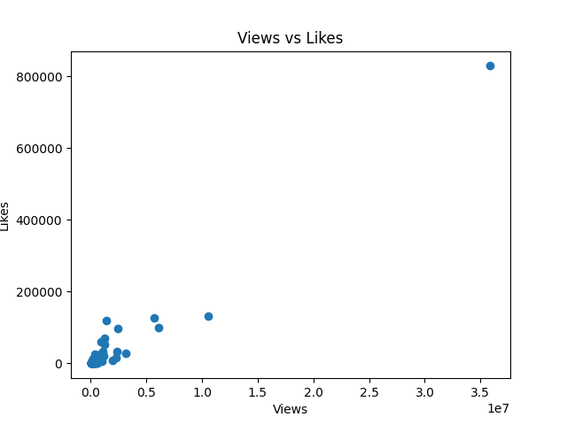

# 📊 Data Cleaning Project

## 👩‍💻 Author
Vedika Tayade

---

## 📌 Project Overview
This project focuses on cleaning and analyzing real-world datasets using Python.

Datasets used:
- Airbnb dataset
- YouTube trending dataset

---

## ⚙️ Tools & Libraries
- Python
- Pandas
- Matplotlib

---

## 🧹 Data Cleaning Steps
- Removed null values
- Handled missing data
- Renamed columns
- Filtered unnecessary data

---

## 📊 Exploratory Data Analysis (EDA)
- Analyzed dataset structure
- Generated insights
- Created visualizations

---

## 📁 Project Structure

01_data → datasets  
02_scripts → python scripts  
03_outputs → graphs  

---

## 📊 Insights

- Most expensive Airbnb listings are concentrated in specific neighbourhood groups like Manhattan.
- Prices vary significantly based on location and room type.
- Some neighbourhoods have consistently higher average prices than others.

- YouTube data shows that videos with higher views tend to have higher likes.
- There is a positive relationship between views and likes.
- A few videos dominate in terms of views, indicating uneven distribution.

- Missing values were identified and handled during data cleaning.
- Duplicate rows were removed to ensure data quality.

  
## 📊 Output Visualization

### Views vs Likes

---

## ⚠️ Note
Only sample dataset (head rows) is uploaded due to size limitations.

---

## 🚀 Conclusion
This project demonstrates basic data cleaning and visualization skills using Python.

